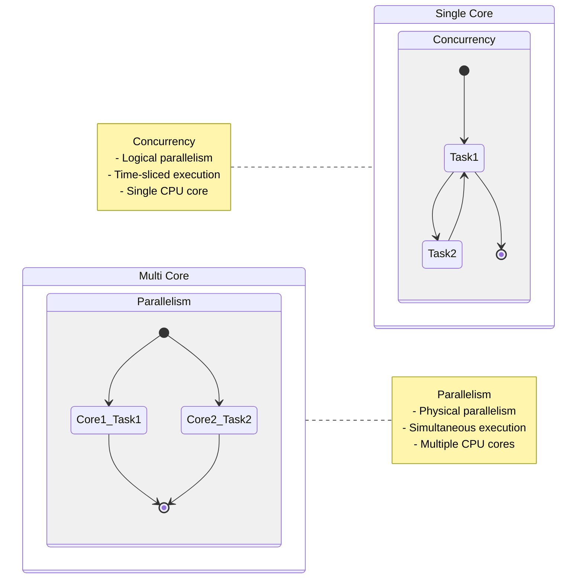

## Introduction: The Power of Parallel Execution

In today’s computing landscape, multithreading is a cornerstone of efficient and responsive applications. It addresses two fundamental challenges:

1. **Performance Enhancement**  
   Modern systems boast multiple CPU cores. Multithreading enables true parallel execution, allowing tasks to run simultaneously and reducing overall processing time.

2. **Application Responsiveness**  
   By offloading time-consuming operations (e.g., file I/O, network requests) to background threads, multithreading keeps user interfaces interactive and prevents freezes.

### Concurrency vs. Parallelism

The distinction is critical:

- **Concurrency**: Logical task-switching on a single core, giving the illusion of simultaneous execution.
- **Parallelism**: Physical simultaneous execution across multiple cores.



Concurrency: Task switching on a single core | Parallelism: True simultaneous execution on multicore systems

This article explores Java’s robust multithreading capabilities, from basic thread creation to advanced concurrency tools, with practical examples and best practices.

## Core Concepts in Java Threading

### Thread Creation Fundamentals

Java provides two primary ways to create threads: extending the Thread class or implementing the Runnable interface. A third, modern approach leverages lambda expressions for concise code.

#### Approach 1: Extending Thread Class

```java
/**
 * Custom thread by extending Thread.
 * Note: Limited by Java's single inheritance constraint.
 */
class CustomThread extends Thread {
    @Override
    public void run() {
        System.out.println("Thread ID: " + Thread.currentThread().getId() + 
                          " | Name: " + Thread.currentThread().getName());
    }
}
```

Pros: Simple for basic use cases.
Cons: Ties your class to Thread, preventing inheritance from other classes.

#### Approach 2: Implementing Runnable

```java
/**
 * Preferred method: Runnable separates task logic from thread management.
 */
class Task implements Runnable {
    @Override
    public void run() {
        System.out.println("Executing in thread: " + 
                           Thread.currentThread().getName());
    }
}

public class ThreadDemo {
    public static void main(String[] args) {
        // Approach 1: Extending Thread
        Thread legacyThread = new CustomThread();
        legacyThread.start();

        // Approach 2: Runnable with traditional class
        Thread taskThread = new Thread(new Task());
        taskThread.start();

        // Modern Approach: Runnable with lambda
        Runnable lambdaTask = () -> {
            System.out.println("Lambda thread running on: " + 
                               Thread.currentThread().getName());
        };
        new Thread(lambdaTask).start();
    }
}
```

* Why Runnable Wins: It decouples task logic from thread mechanics, aligns with composition-over-inheritance principles, and supports lambda expressions for brevity.

* Key Methods

start(): Begins thread execution (calls run() internally).
run(): Defines the thread’s task (override this, not start()).
join(): Waits for the thread to complete.
sleep(long millis): Pauses the thread for a specified duration.

### Synchronization: Protecting Shared Resources

Threads sharing mutable data can lead to race conditions, where the outcome depends on unpredictable execution order. Java offers multiple synchronization mechanisms to ensure thread safety.

Example: Bank Account with Race Condition Risk

```java
class BankAccount {
    private double balance = 1000.0;

    // Unsynchronized: Vulnerable to race conditions
    public void deposit(double amount) {
        balance += amount; // Not atomic; multiple steps involved
    }

    public void withdraw(double amount) {
        if (balance >= amount) {
            balance -= amount;
        }
    }
}
```

If two threads call deposit(100) simultaneously, the balance update might overlap, resulting in lost updates (e.g., only one 100 gets added).

#### Solution 1: Synchronized Methods

```java
class BankAccount {
    private double balance = 1000.0;

    public synchronized void deposit(double amount) {
        balance += amount;
        System.out.println("Deposited: " + amount + " | Balance: " + balance);
    }

    public synchronized void withdraw(double amount) {
        if (balance >= amount) {
            balance -= amount;
            System.out.println("Withdrew: " + amount + " | Balance: " + balance);
        }
    }
}
```

The synchronized keyword locks the object’s intrinsic lock, ensuring only one thread executes the method at a time.

#### Solution 2: Synchronized Blocks with Explicit Locks

```java
class BankAccount {
    private double balance = 1000.0;
    private final Object lock = new Object(); // Dedicated lock object

    public void deposit(double amount) {
        synchronized (lock) {
            balance += amount;
            System.out.println("Deposited: " + amount + " | Balance: " + balance);
        }
    }

    public void withdraw(double amount) {
        synchronized (lock) {
            if (balance >= amount) {
                balance -= amount;
                System.out.println("Withdrew: " + amount + " | Balance: " + balance);
            }
        }
    }
}
```

Advantage: Finer control over which code sections are locked, reducing contention.

#### Solution 3: Atomic Operations with java.util.concurrent.atomic

```java
import java.util.concurrent.atomic.AtomicDouble;

class BankAccount {
    private AtomicDouble balance = new AtomicDouble(1000.0);

    public void deposit(double amount) {
        balance.addAndGet(amount);
    }

    public void withdraw(double amount) {
        double current;
        do {
            current = balance.get();
            if (current < amount) return;
        } while (!balance.compareAndSet(current, current - amount));
    }
}
```
When to Use: Ideal for simple, lock-free updates to primitive-like values.

#### Solution 4: ReadWriteLock for Concurrent Reads

The ReentrantReadWriteLock class provides a pair of locks: ReadLock for multiple concurrent readers and WriteLock for exclusive writers. This is ideal when reads are frequent and writes are rare, as it allows better concurrency than a single lock.

```java
import java.util.concurrent.locks.ReadWriteLock;
import java.util.concurrent.locks.ReentrantReadWriteLock;

class SharedData {
    private int data = 0;
    private final ReadWriteLock lock = new ReentrantReadWriteLock();

    // Multiple threads can read simultaneously
    public int getData() {
        lock.readLock().lock();
        try {
            System.out.println(Thread.currentThread().getName() + " reading data: " + data);
            return data;
        } finally {
            lock.readLock().unlock();
        }
    }

    // Only one thread can write at a time
    public void setData(int newValue) {
        lock.writeLock().lock();
        try {
            System.out.println(Thread.currentThread().getName() + " writing data: " + newValue);
            data = newValue;
        } finally {
            lock.writeLock().unlock();
        }
    }

    public static void main(String[] args) {
        SharedData shared = new SharedData();
        ExecutorService executor = Executors.newFixedThreadPool(5);

        // Simulate multiple readers
        for (int i = 0; i < 4; i++) {
            executor.submit(() -> {
                for (int j = 0; j < 3; j++) {
                    shared.getData();
                    try {
                        Thread.sleep(100); // Simulate work
                    } catch (InterruptedException e) {
                        Thread.currentThread().interrupt();
                    }
                }
            });
        }

        // Simulate a writer
        executor.submit(() -> {
            shared.setData(42);
        });

        executor.shutdown();
    }
}
```

How It Works: 

ReadLock allows multiple threads to read data concurrently, boosting performance when reads dominate.
WriteLock ensures exclusive access during updates, blocking all readers and other writers.

Output Example:
pool-1-thread-1 reading data: 0
pool-1-thread-2 reading data: 0
pool-1-thread-3 reading data: 0
pool-1-thread-5 writing data: 42
pool-1-thread-4 reading data: 42
When to Use: Databases, caches, or any shared resource with frequent reads and occasional writes.

### Advanced Thread Management: Executor Framework

Creating threads manually with new Thread() is inefficient for large-scale applications due to overhead and resource management challenges. The Executor framework (introduced in Java 5) provides a scalable solution.

**Example: Thread Pool with ExecutorService
**
```java
import java.util.concurrent.*;

public class ThreadPoolDemo {
    public static void main(String[] args) {
        // Fixed thread pool with 5 threads
        ExecutorService executor = Executors.newFixedThreadPool(5);

        // Submit 10 tasks
        for (int i = 0; i < 10; i++) {
            final int taskId = i;
            executor.submit(() -> {
                try {
                    Thread.sleep(1000); // Simulate work
                    System.out.printf("Task %d executed by %s%n", 
                                     taskId, Thread.currentThread().getName());
                } catch (InterruptedException e) {
                    Thread.currentThread().interrupt();
                }
            });
        }

        // Graceful shutdown
        executor.shutdown();
        try {
            if (!executor.awaitTermination(10, TimeUnit.SECONDS)) {
                executor.shutdownNow(); // Force shutdown if tasks don't complete
                System.out.println("Forced shutdown triggered.");
            }
        } catch (InterruptedException e) {
            executor.shutdownNow();
            Thread.currentThread().interrupt();
        }
    }
}
```

**Executor Variants**

Executors.newFixedThreadPool(n): Maintains a fixed number of threads.
Executors.newCachedThreadPool(): Creates threads as needed, reusing idle ones.
Executors.newSingleThreadExecutor(): Ensures sequential execution with one thread.

**Benefits**

Reuses threads, reducing creation overhead.
Manages thread lifecycle automatically.
Supports task queuing and scheduling.
Best Practices for Multithreading in Java
Prefer ExecutorService over Manual Threads
Thread pools are more efficient and manageable than raw Thread instances.
Minimize Synchronization Scope
Use synchronized blocks or ReadWriteLock instead of methods when possible to reduce contention.
Leverage High-Level Concurrency Utilities
Use java.util.concurrent classes like CountDownLatch, CyclicBarrier, ReentrantReadWriteLock, or CompletableFuture for complex coordination.
Handle Interruptions Gracefully
Always check for InterruptedException and restore the interrupt status.
Avoid Thread Starvation
Ensure fair resource allocation in thread pools and locks, especially with ReadWriteLock to prevent write starvation.

**Conclusion**

Java’s multithreading capabilities empower developers to build high-performance, responsive applications. From basic Thread and Runnable implementations to advanced tools like ExecutorService and ReentrantReadWriteLock, Java provides a rich toolkit for concurrency needs. By mastering synchronization techniques—whether through synchronized blocks, atomic operations, or read-write locks—you can optimize resource access and avoid pitfalls like race conditions and deadlocks.
Experiment with the examples above, and dive deeper into java.util.concurrent for features like fork-join pools and parallel streams. Happy threading!
